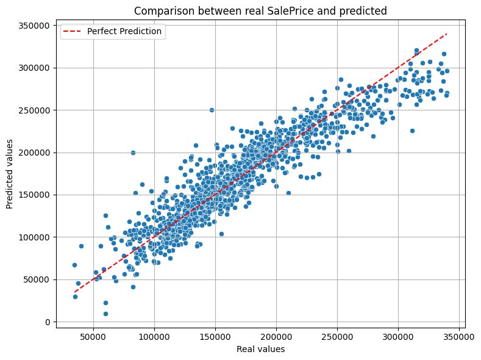

# House Price Prediction Project

## Abstract

This report presents a complete statistical modeling pipeline applied to housing price data from the Ames dataset. After thorough preprocessing, including outlier removal and feature selection, we applied classical inference techniques and built multiple `regression models` to identify key predictors of sale price. We further explored interaction effects through `factorial design` and `ANOVA`. In the final phase, we treated sale prices as a time series and applied `ARIMA` and `SARIMA` models to capture temporal patterns. The best-performing model, `SARIMA(0,1,1)(1,1,0,12)`, showed strong forecasting ability and well-behaved residuals. Our results demonstrate both accurate predictions and valuable insights into the factors driving house prices.

## Introduction

The objective of this project is to predict house prices and understand the influence of different variables on these prices. The analysis involves:
- Preprocessing a real estate dataset to handle missing values and categorical variables.
- Selecting relevant features using statistical techniques.
- Building predictive models using `regression`, `ANOVA`, and time series methods.
- Evaluating the models and interpreting their outputs using both statistical indicators and visual diagnostics.

## Statistical Methods

### Data Preprocessing 1.0

#### Categorical Variable Encoding
We identified 45 categorical variables and converted them explicitly to the category type. These include both ordinal (e.g., `ExterQual`, `OverallQual`) and nominal (e.g., `RoofStyle`) features.

#### One-Hot Encoding

We applied `one-hot encoding` using `pd.get_dummies()` with `drop_first=True` to avoid multicollinearity due to the dummy variable trap. This transformation expanded the dataset to include binary indicator columns for each category level.

### Features Selection

#### Correlation Filtering

We computed the `Pearson correlation matrix` of all numeric and one-hot-encoded variables. To reduce redundancy, we dropped all features that had a pairwise correlation above 0.75 (excluding the diagonal), which helps to reduce multicollinearity and model overfitting.

#### Random Forest

We trained a `RandomForestRegressor` on the encoded dataset to estimate the importance of each feature in predicting `SalePrice`.
We extracted the top 20 most important features, visualized via a barplot, and retained all features with importance > 0.01.


#### Re-encoding Ordinal Values

Categorical features were previously encoded as one-hot vectors. We reintroduced two of them (`ExterQual`, and `OverallQual`). Since `OverallQual` was already an ordinal numerical variable we kept it as it was. Using domain knowledge via ordinal encoding we modified `ExterQual` as follows:

```python
grades = {'Ex': 5, 'Gd': 4, 'TA': 3, 'Fa': 2, 'Po': 1}
```
This allowed us to retain their natural order while simplifying the model and interpretation. Given that we want to maintain the order inside of the variable (10>9>8>...) we converted them to integers. These variables were added back into the final dataset alongside the top features selected by the random forest regressor.

### Data Visualisation

To better understand the distribution of each feature and its relationship with the target variable `SalePrice`, we performed the following visualizations.  
For each variable, we plotted a boxplot. That helps us to detect outliers, skewness, and distribution shape and highlight potential preprocessing needs.

<div align="center">
  
  <p><em>Figure 1. Distribution of GarageCars</em></p>
</div>

<div align="center">
  
  <p><em>Figure 2. Distribution of GrLivArea</em></p>
</div>

<div align="center">
  
  <p><em>Figure 3. Distribution of TotalBsmtSF</em></p>
</div>

<div align="center">
  
  <p><em>Figure 4. Distribution of YearBuilt</em></p>
</div>

<div align="center">
  
  <p><em>Figure 5. Distribution of BsmtFinSF</em></p>
</div>

<div align="center">
  
  <p><em>Figure 6. Distribution of YearRemodAdd</em></p>
</div>

<div align="center">
  
  <p><em>Figure 7. Distribution of 2ndFlrSF</em></p>
</div>

<div align="center">
  
  <p><em>Figure 8. Distribution of LotArea</em></p>
</div>

<div align="center">
  
  <p><em>Figure 9. Distribution of FullBath</em></p>
</div>

<div align="center">
  
  <p><em>Figure 10. Distribution of ExterQual</em></p>
</div>

<div align="center">
  
  <p><em>Figure 11. Distribution of OverallQual</em></p>
</div>

<div align="center">
  
  <p><em>Figure 12. Distribution of SalePrice</em></p>
</div>

### Data Preprocessing 2.0

In the visualisation of our data, we have seen some preoccupant outliers. Therefore, we implemented a systematic cleaning step to identify and handle outliers.

We used the `Interquartile Range (IQR)` method to detect outliers for each numerical feature :

- For each variable X, we compute the 25th percentile $Q_1$ and the 75th percentile $Q_3$.
- The IQR is defined as IQR=$Q_3-Q_1$.
- Observations are considered outliers if they fall outside the range: [Lower Bound, Upper Bound]= $[Q_1−1.5\times \text{IQR}, Q_3+1.5\times \text{IQR}]$

This method was applied to all variables from the selected top features and  `SalePrice` variable. At the same time, lines containing missing values have been deleted.

The result is a cleaned dataset free of extreme values, which ensures that subsequent statistical analyses (regressions, ANOVA, etc.) are not unduly influenced by atypical points.

### First Model

We made our first model based on the top feature retained after preprocessing and outlier removal. To do that we used the `OLS regressor` of the statsmodels module.

<div align="center">

<pre>
                            OLS Regression Results                            
==============================================================================
Dep. Variable:              SalePrice   R-squared:                       0.866
Model:                            OLS   Adj. R-squared:                  0.865
Method:                 Least Squares   F-statistic:                     741.6
Date:                Sun, 25 May 2025   Prob (F-statistic):               0.00
Time:                        18:39:32   Log-Likelihood:                -14508.
No. Observations:                1275   AIC:                         2.904e+04
Df Residuals:                    1263   BIC:                         2.910e+04
Df Model:                          11                                         
Covariance Type:            nonrobust                                         
================================================================================
                   coef    std err          t      P>|t|      [0.025      0.975]
--------------------------------------------------------------------------------
const        -1.122e+06   8.21e+04    -13.663      0.000   -1.28e+06   -9.61e+05
GarageCars    6380.9668   1157.076      5.515      0.000    4110.964    8650.969
GrLivArea       40.0070      4.222      9.475      0.000      31.724      48.290
TotalBsmtSF     25.4943      4.214      6.049      0.000      17.226      33.762
YearBuilt      201.5210     33.069      6.094      0.000     136.645     266.397
BsmtFinSF1      20.8008      1.658     12.546      0.000      17.548      24.053
YearRemodAdd   325.8329     39.822      8.182      0.000     247.708     403.958
2ndFlrSF         7.4890      4.222      1.774      0.076      -0.794      15.772
LotArea          2.2925      0.214     10.700      0.000       1.872       2.713
FullBath     -4785.2188   1695.287     -2.823      0.005   -8111.107   -1459.331
ExterQual     1.314e+04   1733.225      7.583      0.000    9741.985    1.65e+04
OverallQual   1.393e+04    804.222     17.322      0.000    1.24e+04    1.55e+04
================================================================================
Omnibus:                       65.817   Durbin-Watson:                   2.060
Prob(Omnibus):                  0.000   Jarque-Bera (JB):              194.556
Skew:                          -0.192   Prob(JB):                     5.66e-43
Kurtosis:                       4.875   Cond. No.                     1.40e+06
================================================================================

Notes:
[1] Standard Errors assume that the covariance matrix of the errors is correctly specified.
[2] The condition number is large, 1.4e+06. This might indicate that there are
strong multicollinearity or other numerical problems.
</pre>
</div>

The high $R^2$ and significant p-value of the `F-statistic` suggests that the model already explains a substantial portion of the variability in house prices.
Only the `2ndFlrSF` is not significant given the t-test results. The statistical test `Jarque-Bera` tells us that the residuals are not normally distributed ($p-value < 0.05$). The `Durbin-Watson` test suggests no autocorrelation in residuals (Durbin-Watson $\approx$ 2).

### Statistical Inference

We have done some basic statistics on our variables like mean and variance. For each variable we have done a simple linear regression between it and `SalePrice`. We made an hypothesis test based on the fact that the variable impacts `SalePrice` at the $0.05$ significant level. The confidence interval was measured for the coefficient of the linear regression.

<div align='center'>
<style scoped>
    .dataframe tbody tr th:only-of-type {
        vertical-align: middle;
    }

    .dataframe tbody tr th {
        vertical-align: top;
    }

    .dataframe thead th {
        text-align: right;
    }
</style>
<table border="1" class="dataframe">
  <thead>
    <tr style="text-align: right;">
      <th></th>
      <th>Variable</th>
      <th>Mean</th>
      <th>Variance</th>
      <th>Coefficient</th>
      <th>CI 95% Lower</th>
      <th>CI 95% Upper</th>
      <th>T-statistic (H0: impact)</th>
      <th>P-value</th>
      <th>Significant ?</th>
    </tr>
  </thead>
  <tbody>
    <tr>
      <th>0</th>
      <td>GarageCars</td>
      <td>1.706667</td>
      <td>5.010152e-01</td>
      <td>53519.434889</td>
      <td>50127.987569</td>
      <td>56910.882209</td>
      <td>30.959052</td>
      <td>0.0</td>
      <td>Yes</td>
    </tr>
    <tr>
      <th>1</th>
      <td>GrLivArea</td>
      <td>1440.585882</td>
      <td>1.780270e+05</td>
      <td>95.432938</td>
      <td>90.028719</td>
      <td>100.837158</td>
      <td>34.643881</td>
      <td>0.0</td>
      <td>Yes</td>
    </tr>
    <tr>
      <th>2</th>
      <td>TotalBsmtSF</td>
      <td>1030.854902</td>
      <td>1.071431e+05</td>
      <td>101.906910</td>
      <td>93.977110</td>
      <td>109.836710</td>
      <td>25.211727</td>
      <td>0.0</td>
      <td>Yes</td>
    </tr>
    <tr>
      <th>3</th>
      <td>YearBuilt</td>
      <td>1971.332549</td>
      <td>8.844655e+02</td>
      <td>1199.341164</td>
      <td>1115.245814</td>
      <td>1283.436514</td>
      <td>27.978985</td>
      <td>0.0</td>
      <td>Yes</td>
    </tr>
    <tr>
      <th>4</th>
      <td>BsmtFinSF1</td>
      <td>415.620392</td>
      <td>1.564117e+05</td>
      <td>41.115668</td>
      <td>33.403910</td>
      <td>48.827425</td>
      <td>10.459603</td>
      <td>0.0</td>
      <td>Yes</td>
    </tr>
    <tr>
      <th>5</th>
      <td>YearRemodAdd</td>
      <td>1984.780392</td>
      <td>4.219407e+02</td>
      <td>1572.886630</td>
      <td>1444.587807</td>
      <td>1701.185453</td>
      <td>24.051156</td>
      <td>0.0</td>
      <td>Yes</td>
    </tr>
    <tr>
      <th>6</th>
      <td>SecondFlrSF</td>
      <td>328.149804</td>
      <td>1.668390e+05</td>
      <td>41.934160</td>
      <td>34.502515</td>
      <td>49.365804</td>
      <td>11.069913</td>
      <td>0.0</td>
      <td>Yes</td>
    </tr>
    <tr>
      <th>7</th>
      <td>LotArea</td>
      <td>9092.991373</td>
      <td>9.920550e+06</td>
      <td>7.125373</td>
      <td>6.195464</td>
      <td>8.055283</td>
      <td>15.032398</td>
      <td>0.0</td>
      <td>Yes</td>
    </tr>
    <tr>
      <th>8</th>
      <td>FullBath</td>
      <td>1.523922</td>
      <td>2.763111e-01</td>
      <td>65994.256398</td>
      <td>61157.880258</td>
      <td>70830.632538</td>
      <td>26.769933</td>
      <td>0.0</td>
      <td>Yes</td>
    </tr>
    <tr>
      <th>9</th>
      <td>ExterQual</td>
      <td>3.366275</td>
      <td>2.793955e-01</td>
      <td>74226.035381</td>
      <td>69810.474670</td>
      <td>78641.596091</td>
      <td>32.978554</td>
      <td>0.0</td>
      <td>Yes</td>
    </tr>
    <tr>
      <th>10</th>
      <td>OverallQual</td>
      <td>6.021961</td>
      <td>1.541119e+00</td>
      <td>37284.400356</td>
      <td>35750.872533</td>
      <td>38817.928179</td>
      <td>47.697620</td>
      <td>0.0</td>
      <td>Yes</td>
    </tr>
    <tr>
      <th>11</th>
      <td>SalePrice</td>
      <td>169631.212549</td>
      <td>3.341091e+09</td>
      <td>NaN</td>
      <td>NaN</td>
      <td>NaN</td>
      <td>NaN</td>
      <td>NaN</td>
      <td>NaN</td>
    </tr>
  </tbody>
</table>
</div>

All tested variables were found to be statistically significant at the 5% level. However, several variables exhibit large variances (greater than $10^5$) compared to relatively moderate means (mostly below $10^5$), which may indicate instability or heteroskedasticity in the data. 

### Fractional Factorial Design

To investigate the influence of multiple binary factors on housing prices while minimizing the number of experiments, we applied a `fractional factorial design` of the form $2^{11-6} = 2^5 = 32$, derived from 11 binary variables (5 base factors and 6 aliasing generators). This design allows efficient estimation of main effects and low-order interactions.

- Step 1: `Binarization` of Variables  
    We transformed continuous explanatory variables into binary form using their median values:
    Each variable $X$ is transformed into $X_{\text{bin}}\in\{-1,+1\}$, where: $X_{\text{bin}} = +1$ if $X\geq\text{ median}(X)$ and $-1$ otherwise.​
 
    This encoding was applied to all numeric variables except `SalePrice`.

- Step 2: Selection of Factors  
    We selected 5 base factors (The most important factors of `RandomForestRegressor`):
    - `GarageCars_bin`
    - `GrLivArea_bin`
    - `TotalBsmtSF_bin`
    - `YearBuilt_bin`
    - `BsmtFinSF1_bin`

- Step 3: Generator and Aliasing  
    Using a fractional design, we defined 6 aliasing generators to derive 6 additional variables (F to K):  
    Derived Factor	Generator
    - $F$ = `GarageCars_bin` $\times$ `GrLivArea_bin`
    - $G$	= `GarageCars_bin` $\times$ `TotalBsmtSF_bin`
    - $H$	= `GrLivArea_bin` $\times$ `YearBuilt_bin`
    - $I$	= `TotalBsmtSF_bin` $\times$ `BsmtFinSF1_bin`
    - $J$	= `GrLivArea_bin` $\times$ `BsmtFinSF1_bin` 
    - $K$	= `GarageCars_bin` $\times$ `YearBuilt_bin`

    These interactions help represent more complex effects using only 32 combinations.

- Step 4: Experimental Plan and Response  
    A full factorial design $2^{11}$ was reduced to a $2^{11-6}$ fractional factorial design using the selected generators.

    For each of the 32 combinations, we matched the corresponding rows in the dataset and computed the average `SalePrice`.

#### ANOVA

To evaluate the statistical significance of each binary factor and their interactions on the housing price, we conducted an `Analysis of Variance (ANOVA)` on the `fractional factorial design` $2^{11-6}=32$ using the average `SalePrice` as the response variable.

<div align='center'>
<style scoped>
    .dataframe tbody tr th:only-of-type {
        vertical-align: middle;
    }

    .dataframe tbody tr th {
        vertical-align: top;
    }

    .dataframe thead th {
        text-align: right;
    }
</style>
<table border="1" class="dataframe">
  <thead>
    <tr style="text-align: right;">
      <th></th>
      <th>Variable</th>
      <th>SS</th>
      <th>DF</th>
      <th>F</th>
      <th>p_value</th>
      <th>MS</th>
      <th>Significant ?</th>
    </tr>
  </thead>
  <tbody>
    <tr>
      <th>0</th>
      <td>GarageCars_bin</td>
      <td>1.032219e+10</td>
      <td>1.0</td>
      <td>59.687879</td>
      <td>2.802365e-07</td>
      <td>1.032219e+10</td>
      <td>Yes</td>
    </tr>
    <tr>
      <th>1</th>
      <td>GrLivArea_bin</td>
      <td>9.327185e+09</td>
      <td>1.0</td>
      <td>53.934289</td>
      <td>5.829933e-07</td>
      <td>9.327185e+09</td>
      <td>Yes</td>
    </tr>
    <tr>
      <th>2</th>
      <td>TotalBsmtSF_bin</td>
      <td>3.024836e+09</td>
      <td>1.0</td>
      <td>17.491060</td>
      <td>5.053952e-04</td>
      <td>3.024836e+09</td>
      <td>Yes</td>
    </tr>
    <tr>
      <th>3</th>
      <td>YearBuilt_bin</td>
      <td>2.010986e+09</td>
      <td>1.0</td>
      <td>11.628494</td>
      <td>2.936877e-03</td>
      <td>2.010986e+09</td>
      <td>Yes</td>
    </tr>
    <tr>
      <th>4</th>
      <td>BsmtFinSF1_bin</td>
      <td>7.366439e+08</td>
      <td>1.0</td>
      <td>4.259631</td>
      <td>5.295778e-02</td>
      <td>7.366439e+08</td>
      <td>No</td>
    </tr>
    <tr>
      <th>5</th>
      <td>F</td>
      <td>1.051848e+09</td>
      <td>1.0</td>
      <td>6.082293</td>
      <td>2.334086e-02</td>
      <td>1.051848e+09</td>
      <td>Yes</td>
    </tr>
    <tr>
      <th>6</th>
      <td>G</td>
      <td>8.356930e+07</td>
      <td>1.0</td>
      <td>0.483238</td>
      <td>4.953739e-01</td>
      <td>8.356930e+07</td>
      <td>No</td>
    </tr>
    <tr>
      <th>7</th>
      <td>H</td>
      <td>1.699915e+05</td>
      <td>1.0</td>
      <td>0.000983</td>
      <td>9.753155e-01</td>
      <td>1.699915e+05</td>
      <td>No</td>
    </tr>
    <tr>
      <th>8</th>
      <td>I</td>
      <td>9.933181e+04</td>
      <td>1.0</td>
      <td>0.000574</td>
      <td>9.811294e-01</td>
      <td>9.933181e+04</td>
      <td>No</td>
    </tr>
    <tr>
      <th>9</th>
      <td>J</td>
      <td>5.330698e+06</td>
      <td>1.0</td>
      <td>0.030825</td>
      <td>8.624897e-01</td>
      <td>5.330698e+06</td>
      <td>No</td>
    </tr>
    <tr>
      <th>10</th>
      <td>K</td>
      <td>3.329704e+09</td>
      <td>1.0</td>
      <td>19.253957</td>
      <td>3.162816e-04</td>
      <td>3.329704e+09</td>
      <td>Yes</td>
    </tr>
    <tr>
      <th>11</th>
      <td>Residual</td>
      <td>3.285786e+09</td>
      <td>19.0</td>
      <td>NaN</td>
      <td>NaN</td>
      <td>1.729361e+08</td>
      <td>No</td>
    </tr>
    <tr>
      <th>12</th>
      <td>Total</td>
      <td>3.317835e+10</td>
      <td>30.0</td>
      <td>NaN</td>
      <td>NaN</td>
      <td>NaN</td>
      <td></td>
    </tr>
  </tbody>
</table>
</div>

The main effects `GarageCars_bin`, `GrLivArea_bin`, `TotalBsmtSF_bin`, and `YearBuilt_bin` are statistically significant ($p < 0.05$).

Among the interactions, only `F` (`GarageCars_bin` $\times$ `GrLivArea_bin`) and `K` (`GarageCars_bin` $\times$ `YearBuilt_bin`) are significant, suggesting relevant second-order interactions between these variables.

The residual sum of squares is relatively low, indicating good explanatory power of the model ($R^2 = SSR / SST = 90,1 \%$).

#### Reduced Regression Model

Following the `factorial ANOVA`, we constructed a reduced `linear regression model` using only the variables and interaction terms that showed statistical significance ($p-value < 0.05$). This model aims to improve interpretability while retaining explanatory power.
This gave us the following formula 
> $SalePrice \sim GarageCars + GrLivArea + TotalBsmtSF + YearBuilt+ GarageCars \times GrLivArea + GarageCars \times YearBuilt$

<div align="center">
<pre>
                                 OLS Regression Results                            
========================================================================================
 Dep. Variable:              SalePrice   R-squared:                       0.788
 Model:                            OLS   Adj. R-squared:                  0.787
 Method:                 Least Squares   F-statistic:                     783.3
 Date:                Sun, 25 May 2025   Prob (F-statistic):               0.00
 Time:                        18:39:32   Log-Likelihood:                -14801.
 No. Observations:                1275   AIC:                         2.962e+04
 Df Residuals:                    1268   BIC:                         2.965e+04
 Df Model:                           6                                         
 Covariance Type:            nonrobust                                         
========================================================================================
                           coef    std err          t      P>|t|      [0.025      0.975]
----------------------------------------------------------------------------------------
Intercept             -2.84e+05   1.38e+05     -2.052      0.040   -5.56e+05   -1.25e+04
GarageCars           -5.125e+05    7.4e+04     -6.923      0.000   -6.58e+05   -3.67e+05
GrLivArea               39.9608      4.725      8.458      0.000      30.691      49.230
TotalBsmtSF             38.5424      2.653     14.530      0.000      33.338      43.746
YearBuilt              163.9603     71.102      2.306      0.021      24.470     303.450
GarageCars:GrLivArea    13.2259      2.436      5.430      0.000       8.447      18.005
GarageCars:YearBuilt   258.7121     38.100      6.790      0.000     183.967     333.458
========================================================================================
 Omnibus:                       85.833   Durbin-Watson:                   2.070
 Prob(Omnibus):                  0.000   Jarque-Bera (JB):              381.353
 Skew:                           0.065   Prob(JB):                     1.55e-83
 Kurtosis:                       5.676   Cond. No.                     1.10e+06
========================================================================================

Notes:
[1] Standard Errors assume that the covariance matrix of the errors is correctly specified.
[2] The condition number is large, 1.1e+06. This might indicate that there are
strong multicollinearity or other numerical problems.
</pre>
</div>

The model is not as good as the previous one, explaining only 79% of the variability in house prices, but it still confirms its predictive power. All the variables are signifiant at $5\%$ level. The `Jarque-Bera` statistical test indicates that the residuals are not normally distributed ($p-value < 0.05$). The `Durbin-Watson` test suggests the absence of autocorrelation in the residuals (Durbin-Watson $\approx$ 2).

### $2^k$ Factorial Design

In view of the results of the model obtained with the `fractional factorial design` $2^{11-6}$, we decided to also do a $2^k$ `factorial design`.

To evaluate the joint influence of a broader set of binary explanatory variables on housing prices, we implemented a `full factorial design` with k=11 factors, theoretically leading to $2^{11}$=2048 possible treatment combinations.

We reused the binarisation done previously for the 11 factors used in this design.

For each row of the factorial plan, we searched for matching observations in the real dataset. If a match was found, the mean `SalePrice` was computed and retained.

**Results**  
Due to the sparsity of real data, only a subset of combinations was matched successfully.
This design captures all main effects and all possible interactions among the 11 variables.
It provides a complete framework for variance decomposition and effect estimation, although model complexity must be controlled to avoid overfitting.

#### ANOVA

To fully exploit the interaction between 11 binarized features, we applied an `ANOVA` model on the `full factorial design`. This design theoretically includes $2^{11}$=2048 combinations (in our case only 1275 would be possible given the size of our dataset), but only 259 combinations were used since it was the only ones that had at least one corresponding line in the dataset.

<div align='center'>
<style scoped>
    .dataframe tbody tr th:only-of-type {
        vertical-align: middle;
    }

    .dataframe tbody tr th {
        vertical-align: top;
    }

    .dataframe thead th {
        text-align: right;
    }
</style>
<table border="1" class="dataframe">
  <thead>
    <tr style="text-align: right;">
      <th></th>
      <th>Variable</th>
      <th>SS</th>
      <th>DF</th>
      <th>F</th>
      <th>p_value</th>
      <th>MS</th>
      <th>Significant ?</th>
    </tr>
  </thead>
  <tbody>
    <tr>
      <th>0</th>
      <td>GarageCars_bin</td>
      <td>1.167532e+10</td>
      <td>1.0</td>
      <td>22.336615</td>
      <td>3.844707e-06</td>
      <td>1.167532e+10</td>
      <td>Yes</td>
    </tr>
    <tr>
      <th>1</th>
      <td>GrLivArea_bin</td>
      <td>5.745613e+10</td>
      <td>1.0</td>
      <td>109.922037</td>
      <td>1.630514e-21</td>
      <td>5.745613e+10</td>
      <td>Yes</td>
    </tr>
    <tr>
      <th>2</th>
      <td>TotalBsmtSF_bin</td>
      <td>1.507807e+10</td>
      <td>1.0</td>
      <td>28.846573</td>
      <td>1.808128e-07</td>
      <td>1.507807e+10</td>
      <td>Yes</td>
    </tr>
    <tr>
      <th>3</th>
      <td>YearBuilt_bin</td>
      <td>1.141593e+10</td>
      <td>1.0</td>
      <td>21.840350</td>
      <td>4.874106e-06</td>
      <td>1.141593e+10</td>
      <td>Yes</td>
    </tr>
    <tr>
      <th>4</th>
      <td>BsmtFinSF1_bin</td>
      <td>1.087878e+10</td>
      <td>1.0</td>
      <td>20.812707</td>
      <td>7.982510e-06</td>
      <td>1.087878e+10</td>
      <td>Yes</td>
    </tr>
    <tr>
      <th>5</th>
      <td>YearRemodAdd_bin</td>
      <td>1.763920e+10</td>
      <td>1.0</td>
      <td>33.746380</td>
      <td>1.925406e-08</td>
      <td>1.763920e+10</td>
      <td>Yes</td>
    </tr>
    <tr>
      <th>6</th>
      <td>SecondFlrSF_bin</td>
      <td>3.064189e+11</td>
      <td>1.0</td>
      <td>586.224547</td>
      <td>3.670532e-67</td>
      <td>3.064189e+11</td>
      <td>Yes</td>
    </tr>
    <tr>
      <th>7</th>
      <td>LotArea_bin</td>
      <td>8.558623e+09</td>
      <td>1.0</td>
      <td>16.373906</td>
      <td>6.958324e-05</td>
      <td>8.558623e+09</td>
      <td>Yes</td>
    </tr>
    <tr>
      <th>8</th>
      <td>FullBath_bin</td>
      <td>1.017819e+07</td>
      <td>1.0</td>
      <td>0.019472</td>
      <td>8.891344e-01</td>
      <td>1.017819e+07</td>
      <td>No</td>
    </tr>
    <tr>
      <th>9</th>
      <td>ExterQual_bin</td>
      <td>2.308722e+09</td>
      <td>1.0</td>
      <td>4.416926</td>
      <td>3.659721e-02</td>
      <td>2.308722e+09</td>
      <td>Yes</td>
    </tr>
    <tr>
      <th>10</th>
      <td>OverallQual_bin</td>
      <td>3.139085e+10</td>
      <td>1.0</td>
      <td>60.055314</td>
      <td>2.395547e-13</td>
      <td>3.139085e+10</td>
      <td>Yes</td>
    </tr>
    <tr>
      <th>11</th>
      <td>Residual</td>
      <td>1.291066e+11</td>
      <td>247.0</td>
      <td>NaN</td>
      <td>NaN</td>
      <td>5.226989e+08</td>
      <td>No</td>
    </tr>
    <tr>
      <th>12</th>
      <td>Total</td>
      <td>6.019374e+11</td>
      <td>258.0</td>
      <td>NaN</td>
      <td>NaN</td>
      <td>NaN</td>
      <td></td>
    </tr>
  </tbody>
</table>
</div>

The residual sum of squares is relatively low compared to the total (residual is approximatively 19%, total $R^2$ is around 81%), indicating a strong model fit.  
The only non-significant factor is `FullBath_bin`, suggesting minimal impact of bathroom count in this binary formulation.

#### Reduced Regression Model
Using the variables identified as statistically significant in the `full factorial 2¹¹ ANOVA`, we built a refined `linear regression model` to predict `SalePrice` following the formula 
> $SalePrice\sim GarageCars+GrLivArea+TotalBsmtSF+YearBuilt+BsmtFinSF1+YearRemodAdd+SecondFlrSF+LotArea+ExterQual+OverallQual$

<div align='center'>
<pre>
                            OLS Regression Results                            
==============================================================================
Dep. Variable:              SalePrice   R-squared:                       0.865
Model:                            OLS   Adj. R-squared:                  0.864
Method:                 Least Squares   F-statistic:                     810.5
Date:                Sun, 25 May 2025   Prob (F-statistic):               0.00
Time:                        18:59:56   Log-Likelihood:                -14512.
No. Observations:                1275   AIC:                         2.905e+04
Df Residuals:                    1264   BIC:                         2.910e+04
Df Model:                          10                                         
Covariance Type:            nonrobust                                         
================================================================================
                   coef    std err          t      P>|t|      [0.025      0.975]
--------------------------------------------------------------------------------
Intercept    -1.049e+06   7.82e+04    -13.421      0.000    -1.2e+06   -8.96e+05
GarageCars    6273.8936   1159.637      5.410      0.000    3998.869    8548.919
GrLivArea       37.0767      4.104      9.034      0.000      29.025      45.128
TotalBsmtSF     25.0598      4.223      5.934      0.000      16.775      33.345
YearBuilt      175.5063     31.846      5.511      0.000     113.029     237.983
BsmtFinSF1      21.3824      1.650     12.962      0.000      18.146      24.619
YearRemodAdd   313.7257     39.700      7.903      0.000     235.841     391.610
SecondFlrSF      7.4767      4.234      1.766      0.078      -0.829      15.783
LotArea          2.3374      0.214     10.911      0.000       1.917       2.758
ExterQual     1.302e+04   1737.445      7.493      0.000    9610.514    1.64e+04
OverallQual   1.391e+04    806.394     17.247      0.000    1.23e+04    1.55e+04
================================================================================
Omnibus:                       67.265   Durbin-Watson:                   2.050
Prob(Omnibus):                  0.000   Jarque-Bera (JB):              203.583
Skew:                          -0.190   Prob(JB):                     6.20e-45
Kurtosis:                       4.920   Cond. No.                     1.33e+06
================================================================================

Notes:
[1] Standard Errors assume that the covariance matrix of the errors is correctly specified.
[2] The condition number is large, 1.33e+06. This might indicate that there are
strong multicollinearity or other numerical problems.
</pre>
</div>

This model explains 86.5% of the variability in `SalePrice`, confirming the predictive power of the selected features. The model is better than the one obtained with the fractional factorial $2^{k-p}.  
Only the variable `SecondFlrSF` is not significant at the 5% level.  
The p-value of the `Jarque-Bera` statistic test being smaller than $0.05$, the residuals are not normally distributed. The `Durbin-Watson` test suggests the absence of autocorrelation in the residuals (Durbin-Watson > 2).

#### ANOVA

To ensure that `SecondFlrSF` is insignificant, we decided to also run an `ANOVA` on the model.

<div align='center'>
<style scoped>
    .dataframe tbody tr th:only-of-type {
        vertical-align: middle;
    }

    .dataframe tbody tr th {
        vertical-align: top;
    }

    .dataframe thead th {
        text-align: right;
    }
</style>
<table border="1" class="dataframe">
  <thead>
    <tr style="text-align: right;">
      <th></th>
      <th>Variable</th>
      <th>SS</th>
      <th>DF</th>
      <th>F</th>
      <th>p_value</th>
      <th>MS</th>
      <th>Significant ?</th>
    </tr>
  </thead>
  <tbody>
    <tr>
      <th>0</th>
      <td>GarageCars</td>
      <td>1.329836e+10</td>
      <td>1.0</td>
      <td>29.270507</td>
      <td>7.522321e-08</td>
      <td>1.329836e+10</td>
      <td>Yes</td>
    </tr>
    <tr>
      <th>1</th>
      <td>GrLivArea</td>
      <td>3.708235e+10</td>
      <td>1.0</td>
      <td>81.620510</td>
      <td>6.017992e-19</td>
      <td>3.708235e+10</td>
      <td>Yes</td>
    </tr>
    <tr>
      <th>2</th>
      <td>TotalBsmtSF</td>
      <td>1.599687e+10</td>
      <td>1.0</td>
      <td>35.210092</td>
      <td>3.816986e-09</td>
      <td>1.599687e+10</td>
      <td>Yes</td>
    </tr>
    <tr>
      <th>3</th>
      <td>YearBuilt</td>
      <td>1.379880e+10</td>
      <td>1.0</td>
      <td>30.371998</td>
      <td>4.318242e-08</td>
      <td>1.379880e+10</td>
      <td>Yes</td>
    </tr>
    <tr>
      <th>4</th>
      <td>BsmtFinSF1</td>
      <td>7.633127e+10</td>
      <td>1.0</td>
      <td>168.009795</td>
      <td>3.631020e-36</td>
      <td>7.633127e+10</td>
      <td>Yes</td>
    </tr>
    <tr>
      <th>5</th>
      <td>YearRemodAdd</td>
      <td>2.837246e+10</td>
      <td>1.0</td>
      <td>62.449521</td>
      <td>5.908627e-15</td>
      <td>2.837246e+10</td>
      <td>Yes</td>
    </tr>
    <tr>
      <th>6</th>
      <td>SecondFlrSF</td>
      <td>1.416947e+09</td>
      <td>1.0</td>
      <td>3.118787</td>
      <td>7.763575e-02</td>
      <td>1.416947e+09</td>
      <td>No</td>
    </tr>
    <tr>
      <th>7</th>
      <td>LotArea</td>
      <td>5.408405e+10</td>
      <td>1.0</td>
      <td>119.042309</td>
      <td>1.500081e-26</td>
      <td>5.408405e+10</td>
      <td>Yes</td>
    </tr>
    <tr>
      <th>8</th>
      <td>ExterQual</td>
      <td>2.550987e+10</td>
      <td>1.0</td>
      <td>56.148795</td>
      <td>1.258067e-13</td>
      <td>2.550987e+10</td>
      <td>Yes</td>
    </tr>
    <tr>
      <th>9</th>
      <td>OverallQual</td>
      <td>1.351430e+11</td>
      <td>1.0</td>
      <td>297.457912</td>
      <td>5.041960e-60</td>
      <td>1.351430e+11</td>
      <td>Yes</td>
    </tr>
    <tr>
      <th>10</th>
      <td>Residual</td>
      <td>5.742685e+11</td>
      <td>1264.0</td>
      <td>NaN</td>
      <td>NaN</td>
      <td>4.543263e+08</td>
      <td>No</td>
    </tr>
    <tr>
      <th>11</th>
      <td>Total</td>
      <td>9.753024e+11</td>
      <td>1274.0</td>
      <td>NaN</td>
      <td>NaN</td>
      <td>NaN</td>
      <td></td>
    </tr>
  </tbody>
</table>
</div>

The `ANOVA` confirms that most variables in the model contribute significantly to the explained variance, while `SecondFlrSF` does not—thus reinforcing the interpretation from the `OLS` output and supporting decisions about model simplification.

#### Final Regression Model

Removing the variable identified as not statistically significant in the previous `OLS` and `ANOVA` models, we built a refined `linear regression model` to predict `SalePrice` following the formula 
> $SalePrice\sim GarageCars+GrLivArea+TotalBsmtSF+YearBuilt+BsmtFinSF1+YearRemodAdd+LotArea+ExterQual+OverallQual$

<div align="center">
  <pre>
                            OLS Regression Results                            
================================================================================
Dep. Variable:              SalePrice   R-squared:                       0.865
Model:                            OLS   Adj. R-squared:                  0.864
Method:                 Least Squares   F-statistic:                     898.7
Date:                Mon, 26 May 2025   Prob (F-statistic):               0.00
Time:                        12:52:35   Log-Likelihood:                -14513.
No. Observations:                1275   AIC:                         2.905e+04
Df Residuals:                    1265   BIC:                         2.910e+04
Df Model:                           9                                         
Covariance Type:            nonrobust                                         
================================================================================
                   coef    std err          t      P>|t|      [0.025      0.975]
--------------------------------------------------------------------------------
Intercept    -1.059e+06    7.8e+04    -13.569      0.000   -1.21e+06   -9.06e+05
GarageCars    6188.4157   1159.596      5.337      0.000    3913.472    8463.359
GrLivArea       43.5371      1.862     23.386      0.000      39.885      47.189
TotalBsmtSF     18.8266      2.321      8.112      0.000      14.273      23.380
YearBuilt      187.3805     31.154      6.015      0.000     126.261     248.500
BsmtFinSF1      21.2416      1.649     12.881      0.000      18.006      24.477
YearRemodAdd   306.3850     39.514      7.754      0.000     228.864     383.906
LotArea          2.3010      0.213     10.782      0.000       1.882       2.720
ExterQual     1.325e+04   1733.886      7.643      0.000    9850.327    1.67e+04
OverallQual   1.396e+04    806.624     17.301      0.000    1.24e+04    1.55e+04
================================================================================
Omnibus:                       66.832   Durbin-Watson:                   2.053
Prob(Omnibus):                  0.000   Jarque-Bera (JB):              201.031
Skew:                          -0.190   Prob(JB):                     2.22e-44
Kurtosis:                       4.908   Cond. No.                     1.32e+06
================================================================================

Notes:
[1] Standard Errors assume that the covariance matrix of the errors is correctly specified.
[2] The condition number is large, 1.32e+06. This might indicate that there are
strong multicollinearity or other numerical problems.
</pre>
</div>

This linear regression model explains 86.5% of the variability in house prices ($R^2 = 0.865$), with an adjusted $R^2$ of $0.864$ , indicating excellent model fit, like with the previous one. The global F-test is highly significant and better than previously ($F = 898.7$, $p < 0.001$), confirming that the set of predictors collectively explains a significant proportion of variance in `SalePrice`.

All predictors are statistically significant ($p < 0.05$), confirming the validity of their inclusion.

The statistical test `Jarque-Bera` tells us that the residuals are not normally distributed ($p-value < 0.05$). The `Durbin-Watson` test suggests no autocorrelation in residuals (Durbin-Watson $\approx$ 2).

#### Predicted Values vs Actual Values
To evaluate how well the final regression model predicts housing prices, we applied it to the full cleaned dataset and compared the predicted values with the actual sale prices.

<div align='center'>
  
  <p><em>Figure 13. Comparison between predicted and real values</em></p>
</div>

The scatterplot shows a clear alignment of predicted values along the diagonal red dashed line, representing perfect prediction.

Most points are tightly clustered around the line, indicating that the model performs well across a broad range of prices.

Slight deviations from the diagonal appear for extreme values, especially at the lower and upper ends of the price distribution, which may suggest mild under- or over-prediction.

The linear regression model captures the core structure of the housing market and offers strong predictive ability, making it a solid component in our overall modeling pipeline—especially for explainability and feature importance.

### SARIMA

#### Data Preprocessing

To model the temporal dynamics of housing prices, we constructed a monthly time series from the training dataset for use with `SARIMA` modeling.

#### Time Series

The figure below shows the monthly average house sale price over the period covered in the dataset (2006–2010)

<div align="center">
  
  <p><em>Figure 14. Temporal series plot of the sale price</em></p>
</div>

**Observations:**
- The series exhibits strong variability, with spikes in prices around 2006, 2007, 2008 and 2010.
- There is no clear seasonality pattern at first glance, but some periodic fluctuations could indicate latent seasonality.
- There is no clear trend pattern

#### Seasonal Decomposition

To better understand the components driving the variation in monthly average house prices, we applied an additive seasonal decomposition with a 12-month periodicity.

<div align="center">
  
  <p><em>Figure 15. Seasonal decomposition of the time series plot of the sale price</em></p>
</div>

**Trend**

- A downward trend is visible from mid-2007 to early 2009, possibly reflecting the 2008 housing crisis.
- The overall trend appears non-stationary, which justifies differencing in `SARIMA` modeling.

**Seasonality**

- A repeating seasonal pattern is evident, especially visible as peaks around mid-year and dips near the start of each year.
- This supports the use of a seasonal component (S) in `SARIMA`.

**Residuals**

- The residuals fluctuate around zero, suggesting that the decomposition has effectively extracted the trend and seasonal structure.

This decomposition confirms that a `SARIMA` model is appropriate, as the series exhibits both trend and seasonality, and is likely non-stationary. This tells us that we should do a simple and a combined difference.

#### First Differentiation
To assess the stationarity of the average house sale price series, we applied a first-order differencing transformation and evaluated whether a deterministic trend remained.

**Differencing**

We computed the `first difference`: 
> $Y_t^{\prime}=Y_t-Y_{t-1}$.

​
This transformation removes trend components and helps stabilize the mean of the series over time.

<div align="center">
  
  <p><em>Figure 16. Plot of the first differenciation of the series</em></p>
</div>

The values oscillate around 0, indicating that the global trend has been removed, as expected from differencing.

**Trend test via Linear Regression**

We ran a `linear regression` on both the original and the differenced series against time to test for a significant trend and obtained the following p-values $0.025$ (without differentiation) and $0.671$ (with differentiation).

The original time series has a statistically significant upward/downward trend, while the differenced series does not. This suggests that first differencing (d = 1) is sufficient to achieve trend stationarity.

#### Combined Difference

To remove both trend and seasonal effects from the average monthly house sale price series, we applied a `combined differencing operator`:
> $(1-B)(1-B^{12})Y_t = Y_t-Y_{t-1} - Y_{t-12} + Y_{t-13}$​

This transformation is necessary when a time series shows both:
- Non-stationarity in level (trend)
- Repeating seasonal fluctuations (yearly pattern with monthly data).

<div align="center">
  
  <p><em>Figure 17. Combined difference plot of the time series of the sale price</em></p>
</div>

The series now oscillates around zero with no visible trend and no apparent seasonality, indicating that the series is fully stationarized.

Based on this transformation, we set:

- d = 1 (first difference)
- D = 1 (seasonal difference)
- s = 12 (monthly seasonality)

#### ACF/PACF

To identify suitable orders for the `ARIMA` model, we examined the `autocorrelation function (ACF)` and `partial autocorrelation function (PACF)` of the series after combined first and seasonal differencing.

<div align="center">
  
  <p><em>Figure 18. ACF/PACF of the combined differenced series</em></p>
</div>

From the `ACF` and `PACF` we can't see any `AR/MA structure`. So we will start with an `ARIMA model (0,1,0)` and test the following `ARIMA` orders:
- `ARIMA(1,1,0)`
- `ARIMA(0,1,1)`
- `ARIMA(1,1,1)`

#### Comparison of the Different ARIMA Models
To identify the best-fitting non-seasonal `ARIMA` model, we tested multiple order combinations of the form `ARIMA(p, 1, q)`, where d = 1 corresponds to the first difference applied to achieve stationarity.

<div align='center'>
<style scoped>
    .dataframe tbody tr th:only-of-type {
        vertical-align: middle;
    }

    .dataframe tbody tr th {
        vertical-align: top;
    }

    .dataframe thead th {
        text-align: right;
    }
</style>
<table border="1" class="dataframe">
  <thead>
    <tr style="text-align: right;">
      <th></th>
      <th>Order</th>
      <th>AIC</th>
      <th>BIC</th>
    </tr>
  </thead>
  <tbody>
    <tr>
      <th>2</th>
      <td>(0, 1, 1)</td>
      <td>1230.819690</td>
      <td>1234.797658</td>
    </tr>
    <tr>
      <th>1</th>
      <td>(1, 1, 0)</td>
      <td>1232.021891</td>
      <td>1235.999859</td>
    </tr>
    <tr>
      <th>3</th>
      <td>(1, 1, 1)</td>
      <td>1232.639542</td>
      <td>1238.606494</td>
    </tr>
    <tr>
      <th>0</th>
      <td>(0, 1, 0)</td>
      <td>1235.623413</td>
      <td>1237.612397</td>
    </tr>
  </tbody>
</table>
</div>

Among the tested `ARIMA` configurations, the `ARIMA(0, 1, 1)` model is the most parsimonious and best-performing in terms of `AIC` and `BIC`.

##### Residuals 
To validate the adequacy of the best non-seasonal model (`ARIMA(0,1,1)`), we analyzed its residuals.

<div align="center">
  
  <p><em>Figure 19. Residuals plot of the ARIMA(0,1,1) model</em></p>
</div>

The residuals oscillate around zero with no obvious trend or seasonal pattern, which is a good indication of model adequacy.

The `ACF` plot shows no significant autocorrelation beyond lag 0, all ACF spikes fall within the 95% confidence band.

The `PACF` also shows no significant lags.

In conclusion, the `ARIMA(0,1,1)` model is well specified. The residuals show no significant autocorrelation or structure, confirming that this model captures the underlying dynamics of the differenced series.

#### SARIMA Configuration
To incorporate potential seasonal dynamics, we estimated multiple `SARIMA` models combining the previously optimal non-seasonal structure `ARIMA(0,1,1)` with various seasonal components.

<div align='center'>
<style scoped>
    .dataframe tbody tr th:only-of-type {
        vertical-align: middle;
    }

    .dataframe tbody tr th {
        vertical-align: top;
    }

    .dataframe thead th {
        text-align: right;
    }
</style>
<table border="1" class="dataframe">
  <thead>
    <tr style="text-align: right;">
      <th></th>
      <th>Order</th>
      <th>Seasonal</th>
      <th>AIC</th>
      <th>BIC</th>
    </tr>
  </thead>
  <tbody>
    <tr>
      <th>1</th>
      <td>(0, 1, 1)</td>
      <td>(1, 1, 0, 12)</td>
      <td>703.287592</td>
      <td>707.491184</td>
    </tr>
    <tr>
      <th>3</th>
      <td>(0, 1, 1)</td>
      <td>(0, 1, 0, 12)</td>
      <td>940.566400</td>
      <td>943.944159</td>
    </tr>
    <tr>
      <th>0</th>
      <td>(0, 1, 1)</td>
      <td>(0, 1, 1, 12)</td>
      <td>1160.787457</td>
      <td>1164.784071</td>
    </tr>
    <tr>
      <th>2</th>
      <td>(0, 1, 1)</td>
      <td>(1, 1, 1, 12)</td>
      <td>1267.780954</td>
      <td>1273.109772</td>
    </tr>
  </tbody>
</table>
</div>

The best-performing model is `SARIMA(0,1,1)(1,1,0,12)`, with the lowest `AIC = 703.29` and `BIC = 707.49`.

##### Residuals
After identifying `SARIMA(0,1,1)(1,1,0,12)` as the best model, we examined the residuals to assess model adequacy.

<div align="center">
  
  <p><em>Figure 20. Residuals plot of the SARIMA(0,1,1)(1,1,0,12) model</em></p>
</div>

Residuals fluctuate around zero without obvious trend or seasonal pattern, indicating that the model captures the overall dynamics of the data.

`ACF` spikes fall within the 95% confidence bands. This suggests no remaining autocorrelation, confirming that the model has sufficiently captured temporal dependencies.

Like the `ACF`, the partial autocorrelations are all insignificant beyond lag 0.

The residual diagnostics confirm that `SARIMA(0,1,1)(1,1,0,12)` is a well-specified model. The residuals are uncorrelated and centered, validating both the seasonal and non-seasonal components.

#### SARIMA Model (0,1,1)(1,1,0,12)
The selected model is `SARIMA(0,1,1)(1,1,0,12)`, which combines a non-seasonal moving average component with a seasonal autoregressive term. Below is a summary of the estimation results.
<div align='center'>
<pre>
                                          SARIMAX Results                                      
===========================================================================================
Dep. Variable:                           SalePrice   No. Observations:                   55
Model:             SARIMAX(0, 1, 1)x(1, 1, [], 12)   Log Likelihood                -348.644
Date:                             Sun, 25 May 2025   AIC                            703.288
Time:                                     19:00:02   BIC                            707.491
Sample:                                 01-01-2006   HQIC                           704.632
                                      - 07-01-2010                                         
Covariance Type:                               opg                                         
===========================================================================================
                 coef    std err          z      P>|z|      [0.025      0.975]
------------------------------------------------------------------------------
ma.L1         -0.1797      0.194     -0.927      0.354      -0.559       0.200
ar.S.L12      -0.8063      0.298     -2.707      0.007      -1.390      -0.222
sigma2      1.124e+09   1.58e-11   7.13e+19      0.000    1.12e+09    1.12e+09
===========================================================================================
Ljung-Box (L1) (Q):                   2.07   Jarque-Bera (JB):                 1.41
Prob(Q):                              0.15   Prob(JB):                         0.49
Heteroskedasticity (H):               1.08   Skew:                            -0.49
Prob(H) (two-sided):                  0.91   Kurtosis:                         2.58
===========================================================================================

Warnings:
[1] Covariance matrix calculated using the outer product of gradients (complex-step).
[2] Covariance matrix is singular or near-singular, with condition number    inf. Standard errors may be unstable.
</pre>
</div>

The seasonal `AR` term at lag 12 is statistically significant and negative, indicating a strong inverse seasonal relationship (e.g., price tends to revert after 12 months).

The non-seasonal `MA(1)` term is not significant, but including it improves the model’s overall `AIC/BIC`.

The residual variance is quite high but expected given the scale of sale prices.

The model is statistically well-specified, with no residual autocorrelation (p-value of `Ljung-Box` $>0.05$), homoskedastic errors (p-value of `Heteroskedasticity` $>0.05$), and a normal distribution of residuals (p-value of `Jarque-Bera` $>0.05$).

#### SARIMA Model Prediction
To evaluate the model's generalization ability, we split the time series into 80% training data and 20% testing data, and applied `rolling forecast` using the` SARIMA(0,1,1)(1,1,0,12)` model.

<div align="center">
  
  <p><em>Figure 21. Forecast vs Actuals SARIMA(0,1,1)(1,1,0,12)</em></p>
</div>

The model does not perform well. We can see a sort of resemblance between the 2 lines, if we shift the orange line back one month, the two curves would follow the same general direction.

## Conclusion
In this project, we conducted a comprehensive statistical analysis to understand and predict house sale prices based on the Ames Housing dataset. Our approach was structured into several key phases:

- Data Preprocessing and Feature Selection  
  We encoded categorical variables, removed multicollinearity through correlation filtering, and identified the most relevant predictors using a `Random Forest-based` importance ranking. The resulting dataset was cleaned of outliers using the `IQR` method.

- Statistical Inference and Modeling  
Through classical inference, we confirmed the significant influence of variables such as `OverallQual`, `GrLivArea`, and `ExterQual` on sale prices. We built and refined multiple `OLS regression` models, supported by `ANOVA` and some `factorial design` methods to capture key interactions and effects. We done predictions to compare real values to predicted ones.


- Time Series Analysis  
A monthly average price time series was constructed, showing both trend and seasonality. After verifying stationarity through decomposition and differencing, we fitted several `ARIMA` and `SARIMA` models. The best-performing model was identified as `SARIMA(0,1,1)(1,1,0,12)`, based on `AIC/BIC` and residual diagnostics.

- Forecasting and Evaluation  
Using rolling one-step-ahead predictions on a test set, we compared actual and predicted sale prices. The `SARIMA` model captured the general dynamics, though it showed limitations.

---

## Repository
All code and data are available on the following Git repository:  
**[GitHub Repository URL](https://github.com/decimoplays/CStat-Project)** 

